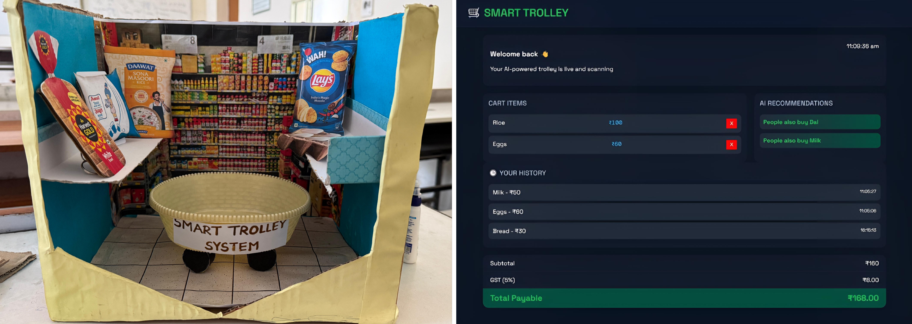

# 🛒 Smart Trolley

Smart Trolley is an IoT-based smart shopping system that uses RFID technology, MQTT communication, and a machine learning-based recommendation system to improve the shopping experience.

The system automatically detects products using RFID cards, updates the shopping cart, calculates the total bill, and provides product recommendations using the Apriori algorithm.

---

<p align="center">
  
</p>

---

## 🚀 Features

- RFID-based product detection
- Automatic cart item and price updates
- Real-time communication using MQTT
- AI-based product recommendations
- Apriori algorithm for association rule mining
- Automatic subtotal, GST, and total calculation
- Interactive web dashboard
- Flask backend with live data updates

---

## 🛠️ Technologies Used

- **Frontend:** HTML, CSS, JavaScript
- **Backend:** Python, Flask
- **Machine Learning:** Apriori Algorithm, Association Rule Mining
- **Communication:** MQTT
- **Hardware:** NodeMCU ESP8266, RFID MFRC522
- **Libraries:** Pandas, Mlxtend, Flask-CORS, Paho-MQTT
- **MQTT Broker:** HiveMQ

---

## 🧠 AI Recommendation System

The `data.json` file contains historical shopping transactions used as the training dataset for the recommendation system.

The Apriori algorithm analyzes these transactions to identify frequently purchased products and generate association rules.

### Example

```json
[
  ["Rice", "Dal"],
  ["Rice", "Dal", "Oil"],
  ["Rice", "Spices"]
]
```

When a customer scans Rice, the system can recommend related products such as Dal or Spices based on the generated association rules.

---

## ⚙️ Installation and Setup

### 1. Clone the Repository

```
git clone https://github.com/your-username/Smart-Trolley.git
```

```
cd Smart-Trolley
```

### 2. Navigate to the folder containing `app.py`:

```
cd webpage
```

### 3. Create and activate a Virtual Environment

```
python3 -m venv venv
```

For macOS and Linux Activation: 

```
source venv/bin/activate
```

For Windows Activation:

```
venv\Scripts\activate
```

### 4. Install Dependencies

```
python -m pip install -r requirements.txt
```

### 5. Run the Flask Application

```
python app.py
```

### 6. Open the Dashboard

Open the generated URL in your browser:

```
http://127.0.0.1:5000
```

---

## 🔌 Arduino Setup

1. Open the Arduino IDE.
2. Open the Arduino file:

   ```
   Smart_Trolley_Arduino.ino
   ```

3. Install the required libraries:
   - MFRC522
   - PubSubClient
   - ESP8266WiFi

4. Update your Wi-Fi credentials in the Arduino code.
5. Select the NodeMCU ESP8266 board.
6. Connect the RFID module to the NodeMCU.
7. Upload the code to the board.
8. Start the Flask backend.
9. Scan an RFID card to send product information through MQTT.
